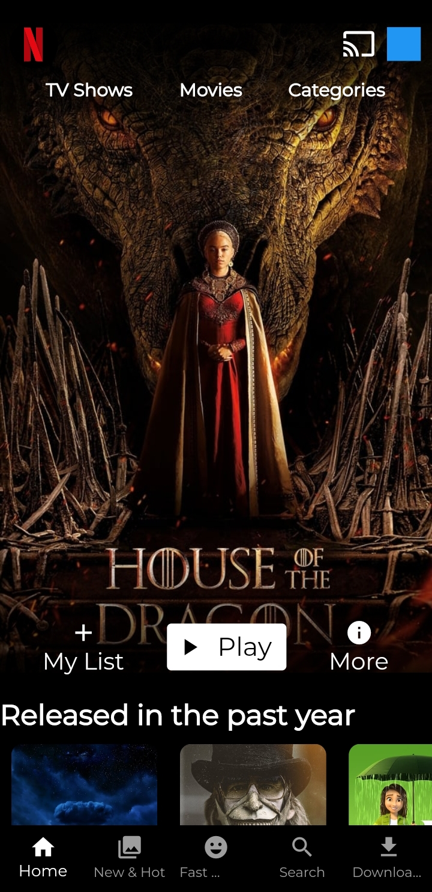
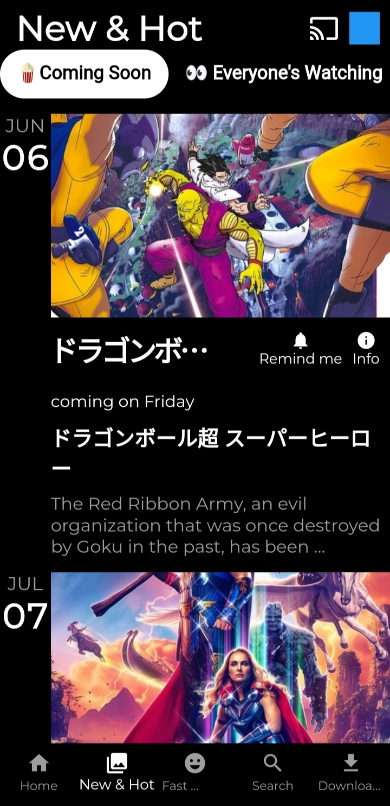
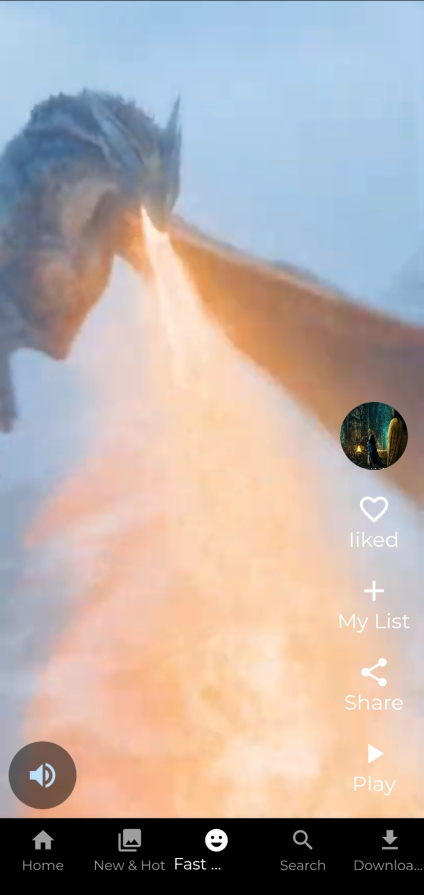
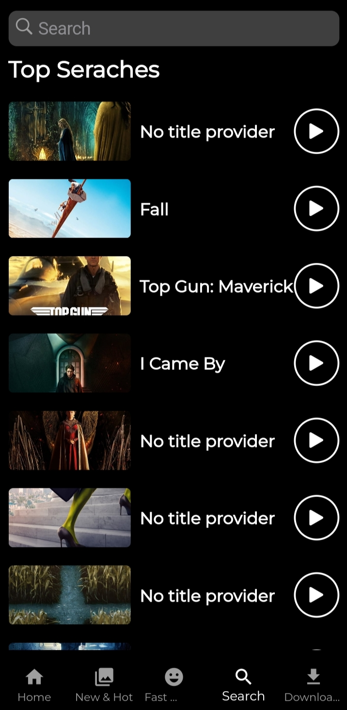
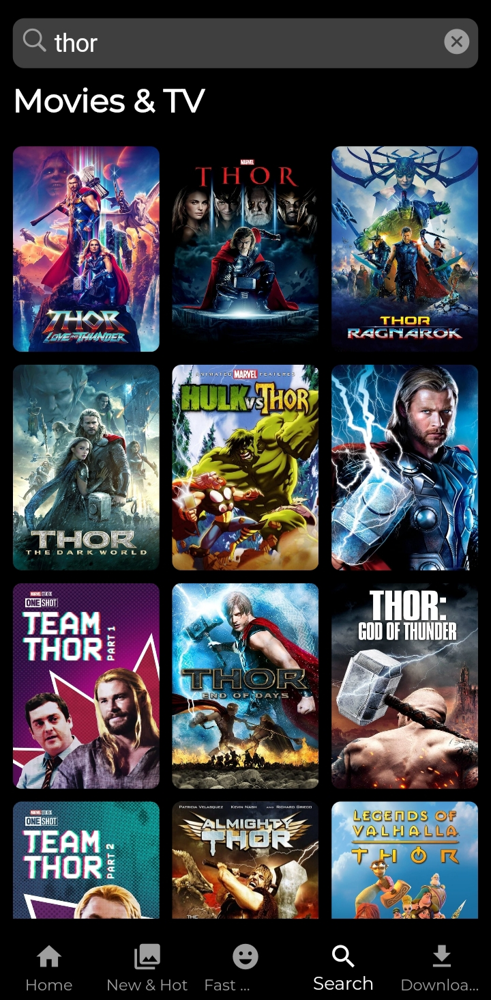
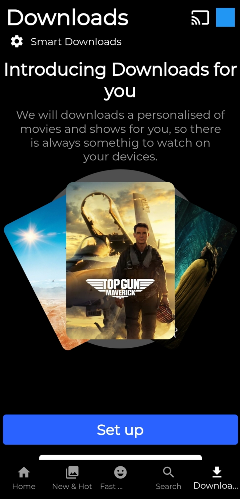

# netflix_clone

I am happy to share with you my first big project in flutter, an online Netflix clone app.
Using IMDb movie api.using Domain Drive Design flutter architecture

## ScreenShots

<table>
    <tr>
        <td></td>
        <td></td>
        <td></td>
    </tr>
    <tr>
        <td></td>
        <td></td>
        <td></td>
    </tr>
</table>

## Screen recorder

https://user-images.githubusercontent.com/66232929/188278892-b07b4d31-e1ed-4054-9fab-1aaf4abd8c8f.MP4

## Android Application Package
Install APK [Click](https://drive.google.com/file/d/1CUuQoBCU_TeazzU8UQqsUO34lYVp68mW/view?usp=sharing)

## Building

-Install Flutter
- `flutter pub get`
- `flutter run`
